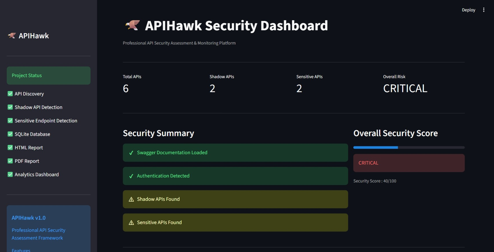
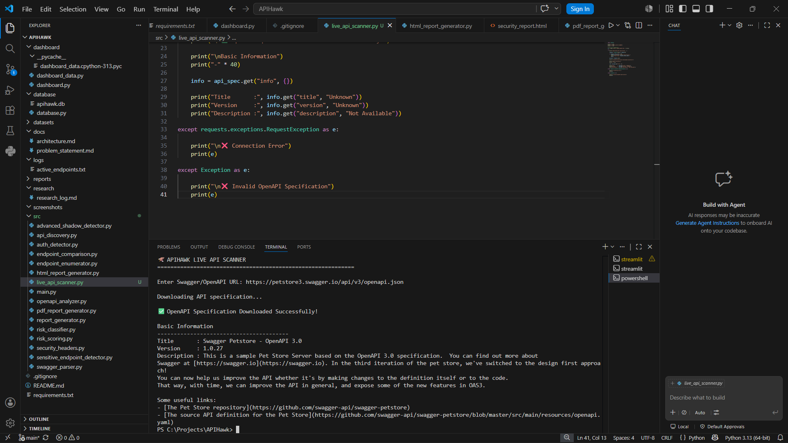
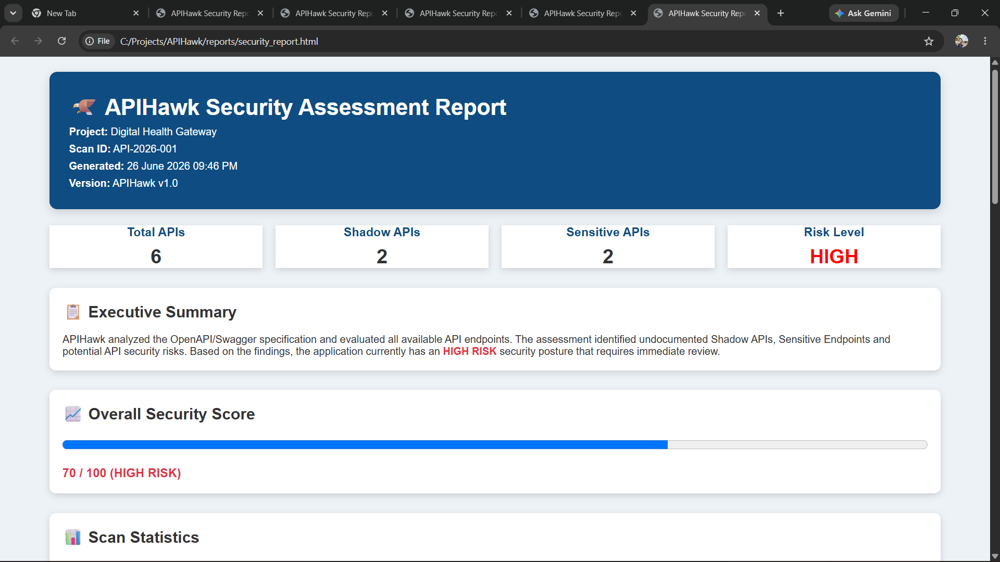
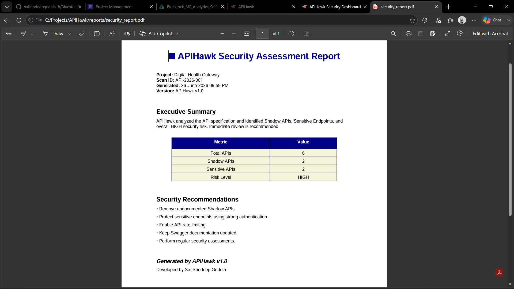

# 🦅 APIHawk

**API Security Assessment & Shadow API Discovery Framework**

APIHawk is a Python-based security assessment framework designed to analyze OpenAPI/Swagger specifications, identify sensitive and undocumented APIs, classify security risks, and generate professional security reports.

## 🌐 Live Demo

🚀 **Try APIHawk Online**

[🚀 Launch APIHawk Live](https://apihawk-security-dashboard.streamlit.app)
---

## 📖 Overview

Modern applications expose numerous APIs, making API security an essential part of application security. APIHawk automates API discovery and performs security analysis by identifying:

* Shadow APIs
* Sensitive endpoints
* Risk levels
* API inventory
* Security reports

The framework also provides an interactive analytics dashboard for visualizing scan results.

---

## ✨ Features

* 🔍 OpenAPI/Swagger API Discovery
* 🛡️ Sensitive Endpoint Detection
* 👤 Shadow API Identification
* 📊 Risk Classification
* 🗄️ SQLite Database Integration
* 📄 HTML Security Report Generation
* 📕 PDF Security Report Generation
* 📈 Streamlit Analytics Dashboard

---

## 🛠️ Technology Stack

* Python 3
* Streamlit
* SQLite
* Requests
* Pandas
* Matplotlib

---

## 📂 Project Structure

```text
APIHawk/
│
├── dashboard/
│   ├── dashboard.py
│   └── dashboard_data.py
│
├── database/
│   └── apihawk.db
│
├── reports/
│   ├── report.html
│   └── report.pdf
│
├── src/
│   ├── database_manager.py
│   ├── live_api_scanner.py
│   ├── html_report_generator.py
│   └── pdf_report_generator.py
│
├── requirements.txt
└── README.md
```

---

## 🚀 Installation

Clone the repository:

```bash
git clone https://github.com/saisandeepgedela18/APIHawk.git
cd APIHawk
```

Install dependencies:

```bash
pip install -r requirements.txt
```

---

## ▶️ Running the Dashboard

```bash
streamlit run dashboard/dashboard.py
```

---

## 📊 Current Modules

* ✅ API Discovery
* ✅ Sensitive Endpoint Detection
* ✅ Risk Classification
* ✅ SQLite Database
* ✅ HTML Report Generator
* ✅ PDF Report Generator
* ✅ Analytics Dashboard

---

## 🎯 Future Enhancements

* JWT Authentication Analysis
* OWASP API Security Top 10 Checks
* Live API Monitoring
* CI/CD Integration
* Docker Support
* Cloud Deployment

---
---

# 📸 Project Screenshots

## 🖥️ Interactive Dashboard



---

## 🔍 Live API Scanner



---

## 📄 Professional HTML Report



---

## 📕 Professional PDF Report



## 👨‍💻 Author

**Sai Sandeep Gedela**

Computer Science Engineering Student

Andhra University College of Engineering

---

## ⭐ Support

If you found this project useful, consider giving it a ⭐ on GitHub.
